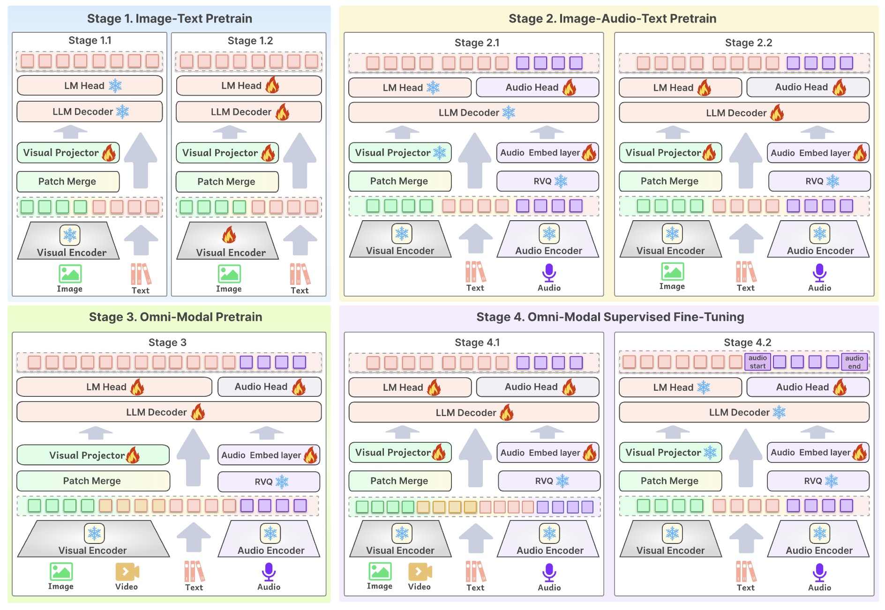

</img> 

  **支持文本、图像、视频、音频输入以及文本、音频输出的全模态大模型**

  <strong>中文 |
  [English](./README.md)</strong>
  
  

  Baichuan-Omni-1.5 <a href="https://huggingface.co/baichuan-inc/Baichuan-Omni-1.5">🤗</a> <a href="xxxx"> 🤖</a> | Baichuan-Omni-1.5-Base <a href="https://huggingface.co/baichuan-inc/Baichuan-Omni-1.5-Base">🤗</a>  | BAICHUAN-OMNI-1.5 TECHNICAL REPORT

**Baichuan-Omni-1.5** 是从 Baichuan-omni 升级的最新的端到端训练的支持全模态输入，双模态输出的多模态大模型。该模型使用了7B的LLLM，可以以端到端方式，接受图像、视频、文本、音频作为输入，并生成高质量文本和语音输出。自2024年10月以来，我们以实现高性能和端到端的兼容多个模态为目标，发布了3个版本的模型。目前系列中最值得关注的模型包括：

- **Baichuan-omni**: Baichuan-omni 是**业内首个**(2024.10)开源的能够处理文本、音频、图像、视频的全模态模型。该模型使用高质量的全模态数据，通过端到端方式训练和推理。

- **Baichuan-Omni-1.5 Base**: 为促进全模态大模型发展，我们开源了使用海量数据训练的全模态基座模型，该模型未经SFT指令微调，可塑性强。Baichuan-Omni-1.5 base 是**业内首个**开源的全模态纯基座模型。

- **Baichuan-Omni-1.5 **: 基于性能强悍的Baichuan-Omni-1.5-base，使用高质量的全模态对齐数据，进行端到端的多模态指令数据训练。Baichuan-Omni-1.5 总参数量 xxx B，**视觉、语音和多模态流式能力达到了 GPT-4o-mini 级别**，是开源社区中模态支持最丰富、性能一流的模型之一。在新的语音模式中，Baichuan-Omni-1.5 **支持高质量可控制声音的中英双语语音对话，还具备情感/语速/风格控制、端到端声音克隆、角色扮演等进阶能力**。模型也进一步提升了 Baichuan-Omni-1.5 的 **真实世界图像、医疗图像理解、和视频理解等视觉能力**。基于其领先的高质量数据、端到端的全模态训练策略，Baichuan-Omni-1.5 成为了**首个在各个模态上都具有一流表现**的全模态大模型。

## Baichuan-Omni-1.5

Baichuan-Omni-1.5 是 Baichuan-omni 系列的最新、性能一流模型。该模型通过端到端方式训练和推理。相比 Baichuan-omni，该模型在文本/图像/音频/视频理解以及文本/音频生成上有了显著提升，并支持了实时语音对话和多模态流式交互的新功能。Baichuan-Omni-1.5 的主要特性包括：

- **多模态理解和交互能力。**
Baichuan-Omni-1.5 接受图像、视频、文本、音频作为输入，并生成高质量文本和语音输出，能够**接受连续的视频和音频流，并和用户进行实时语音交互**。在针对全模态理解的综合评测基准 OminiBench 中，Baichuan-Omni-1.5 取得开源社区一流水平，并**超过了 GPT-4o-mini 和 MiniCPM-o 2.6**。

- **视觉能力。**
Baichuan-Omni-1.5 在 OpenCompass 榜单上（综合 xxx 个主流多模态评测基准）平均得分 xxx，**以 8B 量级的大小在单图理解方面超越了 GPT-4o-mini、Gemini 1.5 Pro 和 Claude 3.5 Sonnet 等主流商用闭源多模态大模型**。此外，它的视频理解表现也**优于 GPT-4V 和 Claude 3.5 Sonnet**，并展现出了优秀的上下文学习能力。

- **语音能力。**
Baichuan-Omni-1.5 **支持高质量可控制声音的中英双语实时对话**。Baichuan-Omni-1.5 在语音理解任务（如 ASR 和 STT 等）**优于 GPT-4o-realtime**，并在语音对话的语义和声学评估中展现了**开源模型中最高的语音生成性能**。它还支持情绪/语速/风格控制、语音克隆、角色扮演等进阶能力。

- **医疗图像理解能力。**
Baichuan-Omni-1.5 在GMAI-MMBench以及Openmm-Medical上取得了最佳的表现。均分上，超过Qwen2-VL-72b 3分，即 80.01 v.s 83.3.

- **真实世界理解能力及其他功能。**
Baichuan-Omni-1.5 进一步优化了 Baichuan-omni 的众多视觉理解能力，其可以处理任意长宽比的图像，像素数可达 180 万（如 1344x1344）。在 RealWorldQA 上取得**68.8分的成绩，超过 GPT-4o-mini 等商用闭源模型以及最近开源的全模态模型MiniCPM-o 2.6。在MMBench上的英文/中文评测子集分别取得85.4/85.0的高分**。

**模型架构**

- **端到端全模态架构。** 通过**多阶段，端到端**的方式训练不同模态的编/解码模块以充分利用丰富的不同模态涵盖的知识。全模态预训练阶段，模型完全使用 NTP 损失进行端到端训练。
- **高质量可控制的声音方案。** 设计了新的多模态系统提示，包含传统文本系统提示词，和**用于指定模型声音的语音系统提示词**。模型可在推理时灵活地通过文字或语音样例控制声音风格，并支持端到端声音克隆和音色创建等高级能力。

**开源评测集**
  - OpenMM-Medical：
    - 为了更全面的评估模型医疗多模态能力，我们构建了OpenMM-Medical，包含来自 42 个公开的医学图像数据集，例如 ACRIMA（眼底图像）、BioMediTech（显微镜图像）和 CoronaHack（X 射线），总共包含 88,996 张图像。
  - OpenAudioBench：
    - 为了更高效的评估模型的“智商”问题，我们构建了OpenAudioBench，共包含5个音频端到端理解子评测集，分别是4个公开评测集（llama question、WEB QA、TriviaQA、AlpacaEval），以及百川团队自建的语音逻辑推理评测集，共2701条数据，能够综合反映模型“智商”水平。

### 多阶段全模态的训练框架

 

### 性能评估
**纯文本理解能力**
|                                 |      | Comprehensive Tasks |              |                |               |
|:-------------------------------:|:----:|:-------------------:|:------------:|:--------------:|:-------------:|
|              Model              | Size |     MMLU (Acc.)     | CMMLU (Acc.) | AGIEval (Acc.) | C-Eval (Acc.) |
|        Proprietary Models       |      |                     |              |                |               |
|              GPT 4o             |   -  |        88.0♢        |     78.3♢    |      62.3♢     |     86.0♢     |
|           GPT 4o mini           |   -  |         82.0        |     67.6     |      52.2      |      63.4     |
|  Open-source Models (Pure text) |      |                     |              |                |               |
|             MAP-Neo             |  7B  |         58.2        |     55.1     |      33.9      |      57.5     |
|          Qwen1.5-Chat           |  7B  |         61.5        |     68.0     |      39.3      |      68.8     |
|         Llama3-Instruct         |  8B  |         67.1        |     51.7     |      38.4      |      50.7     |
|               OLMo              |  7B  |         28.4        |     25.6     |      19.9      |      27.3     |
| Open-source Models (Omni-modal) |      |                     |              |                |               |
|              VITA               | 8x7B |        71.0*        |     46.6     |      46.2*     |     56.7*     |
|            VITA-1.5             |  7B  |         71.0        |     75.1     |      47.9      |      65.6     |
|          Baichuan-Omni          |  7B  |         65.3        |     72.2     |      47.7      |      68.9     |
|          MiniCPM-o 2.6          |  8B  |         65.3        |     63.3     |      50.9      |      61.5     |
|        Baichuan-Omni-1.5        |      |                     |              |                |               |

**图像理解能力**

|             Model             | Size | MMBench-EN | MMbench-CN | M3GIA | SEED-IMG |   MME  | MMMU (val) | HallusionBench | RealWorldQA | MMVet | MathVista-mini | TextVQA (val) | ChartQA | OCRBench |
|:-----------------------------:|:----:|:----------:|:----------:|:-----:|:--------:|:------:|:----------:|:--------------:|:-----------:|:-----:|:--------------:|:-------------:|:-------:|:--------:|
|          Proprietary          |      |            |            |       |          |        |            |                |             |       |                |               |         |          |
|             GPT-4o            |   -  |    83.4    |    82.1    |  59.8 |     -    | 2328.7 |    69.1    |      55.0      |     75.4    |  69.1 |      63.8      |       -       |   85.7  |   73.6   |
|          GPT-4o-mini          |   -  |    77.7    |    76.9    |   -   |   72.3   | 2003.4 |    60.0    |      46.1      |     67.1    |  66.9 |      52.4      |     66.8      |    -    |   78.5   |
| Open Source (Vision-Language) |      |            |            |       |          |        |            |                |             |       |                |               |         |          |
|          Qwen2-VL-7B          |  8B  |    86.4    |    81.9    |  37.3 |   76.5   | 2326.8 |    52.7    |      50.6      |     69.7    |  62.0 |      58.2      |      84.3     |   83.0  |   84.5   |
|     MiniCPM-Llama3-V 2.5      |  8B  |    76.7    |    73.3    |  30.3 |   72.4   | 2024.6 |    45.8    |      42.5      |     63.5    |  52.0 |      54.3      |      76.6     |   72.0  |   72.5   |
|    Open Source (Omni-modal)   |      |            |            |       |          |        |            |                |             |       |                |               |         |          |
|              VITA             | 8x7B |    74.7    |    71.4    |  27.7 |   72.6   | 2189.1 |    45.3    |      39.7      |     59.0    |  41.6 |      44.9      |      71.8     |   76.6  |   68.5   |
|            VITA-1.5           |  7B  |    80.8    |    80.2    |   -   |   74.2   | 2311.0 |    53.1    |      44.1      |     66.8    |  51.1 |      66.2      |      74.2     |   79.6  |   75.2   |
|         Baichuan-Omni         |  7B  |    76.2    |    74.9    |  34.7 |   74.1   | 2186.9 |    47.3    |      47.8      |     62.6    |  65.4 |      51.9      |      74.3     |   79.6  |   70.0   |
|         MiniCPM-o 2.6         |  8B  |    83.6    |    81.8    |   -   |   75.4   | 2372.0 |    51.1    |      50.1      |     67.7    |  65.5 |      71.9      |      80.1     |   86.9  |   89.7   |
|       Baichuan-Omini-1.5      |  7B  |            |            |       |          |        |            |                |             |       |                |               |         |          |

**视频理解能力**
|                                      |      |                 |   General VQA  |                  |                 |                        |     Open-ended VQA    |                        |                |                  |
|:------------------------------------:|:----:|:---------------:|:--------------:|:----------------:|:---------------:|:----------------------:|:---------------------:|:----------------------:|:--------------:|:----------------:|
|                 Model                | Size |     # Frames    | MVBench (Acc.) | Egoschema (Acc.) | VideoMME (Acc.) | Perception-Test (Acc.) | ActivityNet-QA (Acc.) | ActivityNet-QA (Score) | MSVD-QA (Acc.) | MSVD-QA (Score.) |
|          Proprietary Models          |      |                 |                |                  |                 |                        |                       |                        |                |                  |
|            Gemini 1.5 Pro            |      |        -        |      81.3♢     |       63.2*      |      75.0♢      |            -           |         56.7*         |            -           |        -       |         -        |
|              GPT 4o mini             |      |        -        |      55.2      |       58.5       |       65.2      |          48.2          |          59.6         |           3.0          |      75.8      |        3.7       |
|                GPT 4o                |      |        -        |        -       |       77.2*      |      71.9♢      |            -           |         61.9*         |            -           |        -       |         -        |
|                GPT 4V                |      |        -        |      43.7♢     |       55.6*      |      59.9♢      |            -           |         59.5*         |            -           |        -       |         -        |
| Open-source Models (Vision-language) |      |                 |                |                  |                 |                        |                       |                        |                |                  |
|             Qwen2-VL-7B              |  7B  | 2 fps (max 768) |  67.0* \| 64.4 |   66.7* \| 66.6  |  63.3* \| 59.0  |      62.3* \| 60.3     |       17.4\|1.9       |           1.9          |      61.1      |        3.5       |
|                AnyGPT                |  8B  |        48       |      33.2      |       32.1       |       29.8      |          29.1          |          -\|-         |            -           |        -       |         -        |
|             VideoLLaMA 2             |  7B  |        16       |      54.6*     |       51.7*      |      46.6*      |          51.4*         |          50.          |                        |      70.9*     |       3.8*       |
|              VideoChat2              |  7B  |        16       |      51.1*     |       42.1♢      |      33.7♢      |          47.3♢         |         49.1*         |          3.3*          |      70.0*     |       3.9*       |
|           LLaVA-NeXT-Video           |  7B  |        32       |      46.5♢     |       43.9♢      |      33.7♢      |          48.8♢         |         53.5*         |          3.2*          |      67.4      |        3.4       |
|             Video-LLaVA              |  7B  |        8        |      41.0♢     |       38.4♢      |      39.9♢      |          44.3♢         |         45.3*         |          3.3*          |      70.7*     |       3.9*       |
|    Open-source Models (Omni-modal)   |      |                 |                |                  |                 |                        |                       |                        |                |                  |
|                 VITA                 | 8x7B |  1 fps (max 32) |      53.4      |       53.9       |       56.1      |          56.2          |          55.0         |           3.5          |      63.9      |        3.7       |
|               VITA-1.5               |  7B  |  1 fps (max 32) |      55.5      |       54.7       |       58.6      |          57.6          |          59.6         |           3.0          |      57.6      |        3.3       |
|            Baichuan-Omni             |  7B  |  1 fps (max 48) |      60.9      |       58.8       |       58.2      |          56.8          |          58.6         |           3.7          |      72.2      |        4.0       |
|            MiniCPM-o 2.6             |  8B  |  1 fps (max 64) |      58.6      |       50.7       |       66.7      |          66.6          |          63.0         |           3.1          |      73.7      |        3.6       |
|          Baichuan-Omini-1.5          |  7B  |  1 fps (max 48) |                |                  |                 |                        |                       |                        |                |                  |

**语音理解能力**

**语音生成能力**

**全模态理解能力**
|              Model              | Size | Image & Audio | Image Caption & Audio | Image & Audio Transcript | Image Caption & Audio Transcript |
|:-------------------------------:|:----:|:-------------:|:---------------------:|:------------------------:|:--------------------------------:|
|        Proprietary Models       |      |               |                       |                          |                                  |
|            GPT4o-mini           |      |       -       |           -           |           37.0           |               37.7               |
| Open-source Models (Omni-modal) |      |               |                       |                          |                                  |
|            VITA-1.0             |  7B  |      33.1     |          31.8         |           42.0           |               44.2               |
|            VITA-1.5             |  7B  |      33.4     |          29.6         |           48.5           |               47.2               |
|          Baichuan-Omni          |  7B  |      32.2     |          26.5         |           42.6           |               44.2               |
|          MiniCPM-o 2.6          |  8B  |      40.5     |          30.8         |           53.2           |               46.3               |
|        Baichuan-Omni-1.5        |  7B  |      42.9     |          37.7         |           47.9           |               46.9               |

**医疗图像理解能力**
|              Model              | Size | GMAI-MMB-VAL | BC-MED-MQA |
|:-------------------------------:|:----:|:------------:|:----------:|
|        Proprietary Models       |      |              |            |
|            GPT4o-mini           |   -  |     46.7     |    67.5    |
| Open-source Models (Omni-modal) |      |              |            |
|            VITA-1.5             |  7B  |     36.7     |    56.7    |
|          MiniCPM-o 2.6          |  8B  |     41.5     |    71.8    |
|        Baichuan-Omni-1.5        |  7B  |              |            |

### 典型示例

### 本地 WebUI Demo
#### 音频Demo
#### 视频Demo
#### 图像Demo
### 微调
coming soon

### 致谢

- 视觉编码器架构：【NaVit】(https://arxiv.org/abs/2307.06304v1)
- 自动语音识别（ASR, Automatic Speech Recognition）模型：【Whisper】(https://github.com/openai/whisper)
- 大语言模型（LLM）：【Qwen2.5 7B】(https://arxiv.org/abs/2412.15115)

### 声明
我们强烈呼吁所有使用者，不要利用 Baichuan-Omni-1.5/Baichuan-Omni-1.5-Base 模型进行任何危害国家社会安全或违法的活动。另外，我们也要求使用者不要将 Baichuan-Omni-1.5/Baichuan-Omni-1.5-Base 模型用于未经适当安全审查和备案的互联网服务。我们希望所有的使用者都能遵守这个原则，确保科技的发展能在规范和合法的环境下进行。
我们已经尽我们所能，来确保模型训练过程中使用的数据的合规性。然而，尽管我们已经做出了巨大的努力，但由于模型和数据的复杂性，仍有可能存在一些无法预见的问题。因此，如果由于使用 Baichuan-Omni-1.5/Baichuan-Omni-1.5-Base 开源模型而导致的任何问题，包括但不限于数据安全问题、公共舆论风险，或模型被误导、滥用、传播或不当利用所带来的任何风险和问题，我们将不承担任何责任。
### 协议
社区使用  Baichuan-Omni-1.5/Baichuan-Omni-1.5-Base 模型需要遵循 Apache 2.0 和《Baichuan-Omni-1.5/Baichuan-Omni-1.5-Base 模型社区许可协议》。Baichuan-Omni-1.5/Baichuan-Omni-1.5-Base 模型支持商业用途，如果您计划将  Baichuan-Omni-1.5/Baichuan-Omni-1.5-Base 模型或其衍生品用于商业目的，请您确认您的主体符合以下情况：
您或您的关联方的服务或产品的日均用户活跃量（DAU）低于100万。
您或您的关联方不是软件服务提供商、云服务提供商。
您或您的关联方不存在将授予您的商用许可，未经百川许可二次授权给其他第三方的可能。
在符合以上条件的前提下，您需要通过以下联系邮箱 opensource.contact@baichuan-inc.com，提交《Baichuan-Omni-1.5/Baichuan-Omni-1.5-Base 模型社区许可协议》要求的申请材料。审核通过后，百川将特此授予您一个非排他性、全球性、不可转让、不可再许可、可撤销的商用版权许可。
### 引用
如需引用我们的工作，请使用如下 reference:
@article{
}
