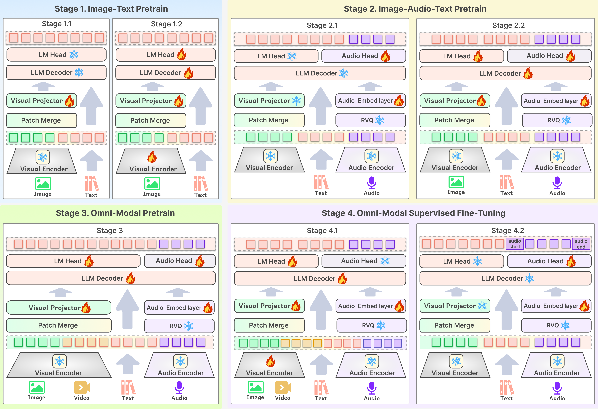
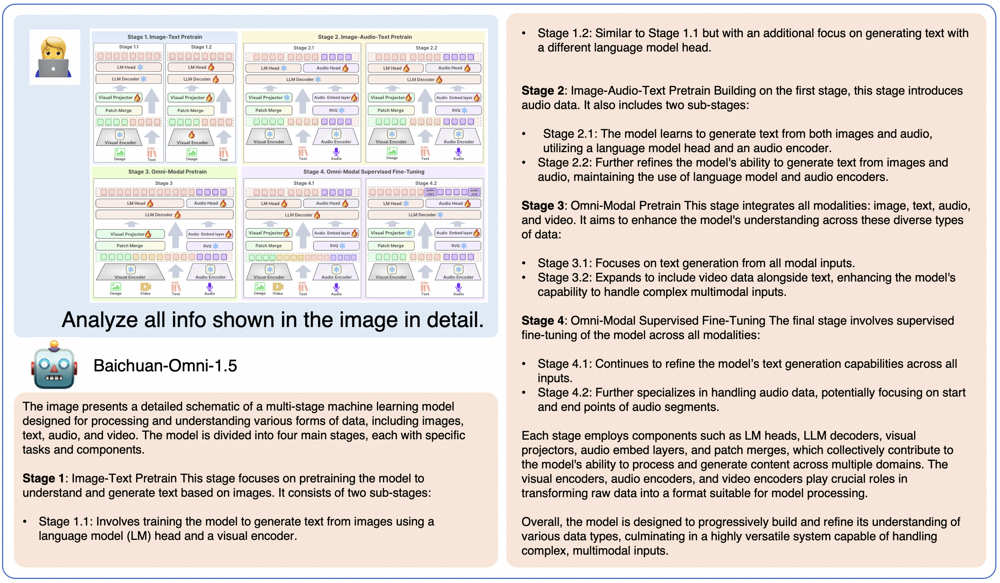

<div align="center">

</img> 

## **开源全模态基座，支持文本、图像、视频、音频输入以及文本、音频输出的全模态大模型**

  <strong>中文 |
  [English](./README.md)</strong>
  
  <p align="center">
  Baichuan-Omni-1.5 <a href="https://huggingface.co/baichuan-inc/Baichuan-Omni-1.5">🤗</a> <a href="xxxx"> 🤖</a> | Baichuan-Omni-1.5-Base <a href="https://huggingface.co/baichuan-inc/Baichuan-Omni-1.5-Base">🤗</a>  | 技术报告 <a href="https://huggingface.co/datasets/baichuan-inc/OpenMM-Medical">📖</a> 
</p>
  <p align="center">
    OpenMM-Medical <a href="https://huggingface.co/datasets/baichuan-inc/OpenMM-Medical">🤗</a> | openAudioBench <a href="https://huggingface.co/datasets/baichuan-inc/openAudioBench">🤗</a> 
</p>
</div>

**Baichuan-Omni-1.5** 是从 Baichuan-omni 升级的最新的、端到端训练的、支持全模态输入/双模态输出的多模态大模型。该模型使用Qwen2.5-7B作为大语言模型基座，可以以端到端方式，接受图像、视频、文本、音频作为输入，并且以可控的方式生成高质量文本和语音。

- **Baichuan-Omni-1.5-Base**: 为促进全模态大模型发展，我们开源了使用高质量海量数据训练的全模态基座模型。该模型未经SFT指令微调，可塑性强，是目前性能最好的全模态基座模型**。

- **Baichuan-Omni-1.5**: 基于性能强悍的Baichuan-Omni-1.5-base，使用高质量的全模态对齐数据，进行端到端的多模态指令数据训练。Baichuan-Omni-1.5的纯文本、图像、视频、音频理解能力达到了 GPT-4o-mini 级别。可控音频生成的能力十分强大，在xxx和xxx评测集上取得最高表现。

## 📖 目录

- [🏁 Baichuan-Omni-1.5](#baichuan-omni-1.5)
- [🧠 多阶段全模态的训练框架](#多阶段全模态的训练框架)
- [📊 性能评估](#性能评估)
  <!-- - [纯文本理解能力](#纯文本理解能力)
  - [图像理解能力](#图像理解能力)
  - [视频理解能力](#视频理解能力)
  - [语音理解能力](#语音理解能力)
  - [语音生成能力](#语音生成能力)
  - [全模态理解能力](#全模态理解能力)
  - [医疗图像理解能力](#医疗图像理解能力) -->
- [🍰 典型示例](#典型示例)
- [🚀 本地 WebUI Demo](#本地-WebUI-Demo)
  - [图像Demo](#图像demo)
  - [视频Demo](#视频demo)
  - [音频Demo](#音频demo)
- [⚙️ 微调](#微调)
- [📣 致谢](#致谢)
- [⚠️ 声明](#声明)
- [📜 协议](#协议)
- [📜 引用](#引用)

## Baichuan-Omni-1.5

Baichuan-Omni-1.5 是 Baichuan-omni 系列的最新、性能一流模型。该模型通过端到端方式训练和推理。相比 Baichuan-omni，该模型在文本/图像/音频/视频理解以及文本/音频生成上有显著提升，并支持了可控的实时语音对话和多模态实时交互的新功能。Baichuan-Omni-1.5 的主要特性包括：

- **多模态理解和交互能力**
Baichuan-Omni-1.5 接受图像、视频、文本、音频作为输入，并生成高质量文本和语音输出，能够**接受连续的视频和音频流，并和用户进行实时语音交互**。在针对全模态理解的综合评测基准 OminiBench 中，Baichuan-Omni-1.5 取得开源社区一流水平，并**超过了 GPT-4o-mini**。

- **优秀的视觉能力。**
Baichuan-Omni-1.5 在 OpenCompass 榜单上（综合 xxx 个主流多模态评测基准）平均得分 xxx，**在7B量级的大小下，在单图理解方面超越了 GPT-4o-mini、Gemini 1.5 Pro 和 Claude 3.5 Sonnet 等主流商用闭源多模态大模型**。此外，它的视频理解表现也**优于 GPT-4V 和 Claude 3.5 Sonnet**以及开源的全模态模型。

- **出色的语音能力。**
Baichuan-Omni-1.5 **支持高质量可控制声音的中英双语实时对话**。Baichuan-Omni-1.5 在语音理解任务（如 ASR 和 STT 等）**优于 GPT-4o-realtime**，并在语音对话的语义和声学评估中展现了**开源模型中最高的语音生成性能**。它还支持情绪/语速/风格控制、语音克隆、角色扮演等进阶能力。

- **领先的医疗图像理解能力。**
Baichuan-Omni-1.5 在GMAI-MMBench以及Openmm-Medical上取得了最佳的表现。仅使用7B的LLM，均分超过Qwen2-VL-72b 3%，即 80.01% v.s 83.3%。

- **强大的真实世界理解能力及其他功能。**
Baichuan-Omni-1.5 进一步优化了 Baichuan-omni 的众多视觉理解能力，其可以处理任意长宽比的图像，像素数可达 180 万（如 1344x1344）。在 RealWorldQA 上取得68.8分的成绩，**超过 GPT-4o-mini** 等商用闭源模型以及最近开源的全模态模型。在MMBench上的英文/中文评测子集分别取得85.4/85.0的高分，该表现也处于同级别模型中的第一梯队。

**模型架构**

- **端到端全模态架构。** 通过**多阶段，端到端**渐进式的方式训练不同模态的编/解码模块以充分利用不同模态涵盖的丰富知识，期待不同模态知识互补。全模态预训练阶段，模型完全使用 NTP 损失进行端到端训练。
- **高质量可控制的声音方案。** 重新设计了多模态系统提示，包含传统文本系统提示词，和**用于指定模型声音的语音系统提示词**。模型可在推理时灵活地通过文字或语音样例控制声音风格，并支持端到端声音克隆和音色创建等高级能力。


### 多阶段全模态的训练框架

<div align="center">

</div>

<br>

### 性能评估

<div align="center">

</div>

<br>

<details>

<summary>点击查看纯文本理解能力详细评测结果。</summary>

#### 纯文本理解能力
<div align="center">
    <table style="margin: 0 auto; text-align: center;">
    <thead>
        <tr>
            <th class="tg-c3ow" colspan="7">Comprehensive Tasks</th>
        </tr>
    </thead>
    <tbody>
    <tr>
        <td>Model</td>
        <td>Size</td>
        <td>MMLU (Acc.)</td>
        <td>CMMLU (Acc.)</td>
        <td>AGIEval (Acc.)</td>
        <td>C-Eval (Acc.)</td>
        <td>GAOKAO (Acc.)</td>
    </tr>
    <tr>
        <td colspan="7">Proprietary Models</td>
    </tr>
    <tr>
        <td>GPT 4o</td>
        <td>-</td>
        <td><b>88.0♢<br></td>
        <td><b>78.3♢<br></td>
        <td><b>62.3♢<br></td>
        <td><b>86.0♢<br></td>
        <td>-</td>
    </tr>
    <tr>
        <td>GPT 4o mini</td>
        <td>-</td>
        <td>82.0</td>
        <td>67.6</td>
        <td>52.2</td>
        <td>63.6</td>
        <td>70.8</td>
    </tr>
    <tr>
         <td colspan="7">Open-source Models (Pure text)</td>
    </tr>
    <tr>
        <td>MAP-Neo</td>
        <td>7B</td>
        <td>58.2</td>
        <td>55.1</td>
        <td>33.9</td>
        <td>57.5</td>
        <td>-</td>
    </tr>
    <tr>
        <td>Qwen1.5-Chat</td>
        <td>7B</td>
        <td>61.5</td>
        <td>68.0</td>
        <td>39.3</td>
        <td>68.8</td>
        <td>-</td>
    </tr>
    <tr>
        <td>Llama3-Instruct</td>
        <td>8B</td>
        <td>67.1</td>
        <td>51.7</td>
        <td>38.4</td>
        <td>50.7</td>
        <td>-</td>
    </tr>
    <tr>
        <td>OLMo</td>
        <td>7B</td>
        <td>28.4</td>
        <td>25.6</td>
        <td>19.9</td>
        <td>27.3</td>
        <td>-</td>
    </tr>
    <tr>
         <td colspan="7">Open-source Models (Omni-modal)</td>
    </tr>
    <tr>
        <td>VITA</td>
        <td>8x7B</td>
        <td>71.0*</td>
        <td>46.6</td>
        <td>46.2*</td>
        <td>56.7*</td>
        <td>-</td>
    </tr>
    <tr>
        <td>VITA-1.5</td>
        <td>7B</td>
        <td>71.0</td>
        <td>75.1</td>
        <td>47.9</td>
        <td>65.6</td>
        <td>57.4</td>
    </tr>
    <tr>
        <td>Baichuan-Omni</td>
        <td>7B</td>
        <td>65.3</td>
        <td>72.2</td>
        <td>47.7</td>
        <td>68.9</td>
        <td>-</td>
    </tr>
    <tr>
        <td>MiniCPM-o 2.6</td>
        <td>7B</td>
        <td>65.3</td>
        <td>63.3</td>
        <td>50.9</td>
        <td>61.5</td>
        <td>56.3</td>
    </tr>
    <tr>
        <td><b>Baichuan-Omni-1.5<br></td>
        <td>7B</td>
        <td>72.2</td>
        <td>75.5</td>
        <td>54.4</td>
        <td>73.1</td>
        <td><b>73.5<br></td>
    </tr>
    </tbody>
    </table>
</div>

</details>

<details>

<summary>点击查看图像理解能力详细评测结果。</summary>

#### 图像理解能力
<div align="center">
  <table style="margin: 0 auto; text-align: center;">
    <thead>
      <tr>
         <th class="tg-c3ow" colspan="9">Multi-choice &amp; Yes-or-No Question</th>
      </tr>
    </thead>
    <tbody>
      <tr>
        <td>Model</td>
        <td>Size</td>
        <td>MMBench-EN (Acc.)</td>
        <td>MMbench-CN (Acc.)</td>
        <td>SEED-IMG (Acc.)</td>
        <td>MMMU-val (Acc.)</td>
        <td>HallusionBench (Acc.)</td>
      </tr>
      <tr>
        <td colspan="9">Proprietary Models</td>
      </tr>
      <tr>
        <td>GPT-4o</td>
        <td>-</td>
        <td>83.4♢</td>
        <td>82.1♢</td>
        <td>-</td>
        <td><b>69.1♢<br></td>
        <td><b>55.0♢<br></td>
      </tr>
      <tr>
        <td>GPT-4o-mini</td>
        <td>-</td>
        <td>77.7</td>
        <td>76.9</td>
        <td>72.3</td>
        <td>60.0♢</td>
        <td>46.1♢</td>
      </tr>
      <tr>
        <td colspan="9">Open Source Models (Vision-Language)</td>
      </tr>
      <tr>
        <td>Qwen2-VL-7B</td>
        <td>7B</td>
        <td><b>86.4<br></td>
        <td>81.9</td>
        <td><b>76.5<br></td>
        <td>52.7</td>
        <td>50.6∗</td>
      </tr>
      <tr>
        <td>MiniCPM-Llama3-V 2.5</td>
        <td>8B</td>
        <td>76.7</td>
        <td>73.3</td>
        <td>72.4</td>
        <td>45.8∗</td>
        <td>42.5</td>
      </tr>
      <tr>
        <td colspan="9">Open Source Models (Omni-modal)</td>
      </tr>
      <tr>
        <td>VITA</td>
        <td>8x7B</td>
        <td>74.7</td>
        <td>71.4</td>
        <td>72.6</td>
        <td>45.3</td>
        <td>39.7∗</td>
      </tr>
      <tr>
        <td>VITA-1.5</td>
        <td>7B</td>
        <td>80.8</td>
        <td>80.2</td>
        <td>74.2</td>
        <td>53.1</td>
        <td>44.1</td>
      </tr>
      <tr>
        <td>Baichuan-Omni</td>
        <td>7B</td>
        <td>76.2</td>
        <td>74.9</td>
        <td>74.1</td>
        <td>47.3</td>
        <td>47.8</td>
      </tr>
      <tr>
        <td>MiniCPM-o 2.6</td>
        <td>7B</td>
        <td>83.6</td>
        <td>81.8</td>
        <td>75.4</td>
        <td>51.1</td>
        <td>50.1</td>
      </tr>
      <tr>
        <td><b>Baichuan-Omni-1.5<br></td>
        <td>7B</td>
        <td>85.6</td>
        <td><b>83.6<br></td>
        <td>75.7</td>
        <td>53.9</td>
        <td>49.7</td>
      </tr>
    </tbody>
  </table>
</div>


<br>

<div align="center">
  <table style="margin: 0 auto; text-align: center;">
    <thead>
      <tr>
        <th class="tg-c3ow" colspan="9">Visual Question Answering</th>
      </tr>
    </thead>
    <tbody>
      <tr>
        <td>Model</td>
        <td>Size</td>
        <td>RealWorldQA (Acc.)</td>
        <td>MathVista-mini (Acc.)</td>
        <td>TextVQA-val (Acc.)</td>
        <td>ChartQA (Acc.)</td>
        <td>OCRBench (Acc.)</td>
      </tr>
      <tr>
        <td colspan="8">Proprietary Models</td>
      </tr>
      <tr>
        <td>GPT-4o</td>
        <td>-</td>
        <td><b>75.4♢<br></td>
        <td>63.8♢</td>
        <td>-</td>
        <td>85.7♢</td>
        <td>73.6♢</td>
      </tr>
      <tr>
        <td>GPT-4o-mini</td>
        <td>-</td>
        <td>66.3</td>
        <td>53.4</td>
        <td>66.8</td>
        <td>-</td>
        <td>77.4</td>
      </tr>
      <tr>
        <td colspan="8">Open Source Models (Vision-Language)</td>
      </tr>
      <tr>
        <td>Qwen2-VL-7B</td>
        <td>7B</td>
        <td>69.7</td>
        <td>58.2∗</td>
        <td><b>84.3∗<br></td>
        <td>83.0∗</td>
        <td>84.5∗</td>
      </tr>
      <tr>
        <td>MiniCPM-Llama3-V 2.5</td>
        <td>8B</td>
        <td>63.5</td>
        <td>54.3∗</td>
        <td>76.6</td>
        <td>72.0</td>
        <td>72.5</td>
      </tr>
      <tr>
        <td colspan="8">Open Source Models (Omni-modal)</td>
      </tr>
      <tr>
        <td>VITA</td>
        <td>8x7B</td>
        <td>59.0</td>
        <td>44.9∗</td>
        <td>71.8</td>
        <td>76.6</td>
        <td>68.5∗</td>
      </tr>
      <tr>
        <td>VITA-1.5</td>
        <td>7B</td>
        <td>66.8</td>
        <td><b>66.5<br></td>
        <td>74.9</td>
        <td>79.6</td>
        <td>73.3</td>
      </tr>
      <tr>
        <td>Baichuan-Omni</td>
        <td>7B</td>
        <td>62.6</td>
        <td>51.9</td>
        <td>74.3</td>
        <td>79.6</td>
        <td>70.0</td>
      </tr>
      <tr>
        <td>MiniCPM-o 2.6</td>
        <td>7B</td>
        <td>67.7</td>
        <td>64.6</td>
        <td>80.1</td>
        <td><b>87.6<br></td>
        <td><b>89.7∗<br></td>
      </tr>
       <tr>
        <td>Baichuan-Omni-1.5 </td>
        <td>7B</td>
        <td>68.8</td>
        <td>63.6</td>
        <td>83.2</td>
        <td>84.9</td>
        <td>84.0</td>
      </tr>
    </tbody>
  </table>
</div>


</details>

<details>

<summary>点击查看视频理解能力详细评测结果。</summary>

#### 视频理解能力
<div align="center">
  <table style="margin: 0 auto; text-align: center;">
    <thead>
      <tr>
        <th colspan="7">General VQA&nbsp;&nbsp;&nbsp;</th>
      </tr>
    </thead>
    <tbody>
      <tr>
        <td>Model</td>
        <td>Size</td>
        <td># Frames</td>
        <td>MVBench (Acc.)</td>
        <td>Egoschema (Acc.)</td>
        <td>VideoMME (Acc.)</td>
        <td>Perception-Test (Acc.)</td>
      </tr>
      <tr>
        <td colspan="7">Proprietary Models</td>
      </tr>
      <tr>
        <td>Gemini 1.5 Pro</td>
        <td>-</td>
        <td>-</td>
        <td><b>81.3♢<br></td>
        <td>63.2*</td>
        <td><b>75.0♢<br></td>
        <td>-</td>
      </tr>
      <tr>
        <td>GPT 4o mini</td>
        <td>-</td>
        <td>-</td>
        <td>55.2</td>
        <td>58.5</td>
        <td>63.6</td>
        <td>48.2</td>
      </tr>
      <tr>
        <td>GPT 4o</td>
        <td>-</td>
        <td>-</td>
        <td>-</td>
        <td><b>77.2*<br></td>
        <td>71.9♢</td>
        <td>-</td>
      </tr>
      <tr>
        <td>GPT 4V</td>
        <td>-</td>
        <td>-</td>
        <td>43.7♢</td>
        <td>55.6*</td>
        <td>59.9♢</td>
        <td>-</td>
      </tr>
      <tr>
        <td colspan="7">Open-source Models (Vision-language)</td>
      </tr>
      <tr>
        <td>Qwen2-VL-7B</td>
        <td>7B</td>
        <td>2 fps (max 768)</td>
        <td>67.0* | 64.4</td>
        <td>66.7* | 66.6</td>
        <td>63.3* | 59.0</td>
        <td>62.3* | 60.3</td>
      </tr>
      <tr>
        <td>AnyGPT</td>
        <td>8B</td>
        <td>48</td>
        <td>33.2</td>
        <td>32.1</td>
        <td>29.8</td>
        <td>29.1</td>
      </tr>
      <tr>
        <td>VideoLLaMA 2</td>
        <td>7B</td>
        <td>16</td>
        <td>54.6*</td>
        <td>51.7*</td>
        <td>46.6*</td>
        <td>51.4*</td>
      </tr>
      <tr>
        <td>VideoChat2</td>
        <td>7B</td>
        <td>16</td>
        <td>51.1*</td>
        <td>42.1♢</td>
        <td>33.7♢</td>
        <td>47.3♢</td>
      </tr>
      <tr>
        <td>LLaVA-NeXT-Video</td>
        <td>7B</td>
        <td>32</td>
        <td>46.5♢</td>
        <td>43.9♢</td>
        <td>33.7♢</td>
        <td>48.8♢</td>
      </tr>
      <tr>
        <td>Video-LLaVA</td>
        <td>7B</td>
        <td>8</td>
        <td>41.0♢</td>
        <td>38.4♢</td>
        <td>39.9♢</td>
        <td>44.3♢</td>
      </tr>
      <tr>
        <td colspan="7">Open-source Models (Omni-modal)</td>
      </tr>
      <tr>
        <td>VITA</td>
        <td>8x7B</td>
        <td>1 fps (max 32)</td>
        <td>53.4</td>
        <td>53.9</td>
        <td>56.1</td>
        <td>56.2</td>
      </tr>
      <tr>
        <td>VITA-1.5</td>
        <td>7B</td>
        <td>1 fps (max 32)</td>
        <td>55.5</td>
        <td>54.7</td>
        <td>57.3</td>
        <td>57.6</td>
      </tr>
      <tr>
        <td>Baichuan-Omni</td>
        <td>7B</td>
        <td>1 fps (max 32)</td>
        <td>60.9</td>
        <td>58.8</td>
        <td>58.2</td>
        <td>56.8</td>
      </tr>
      <tr>
        <td>MiniCPM-o 2.6</td>
        <td>7B</td>
        <td>1 fps (max 64)</td>
        <td>58.6</td>
        <td>50.7</td>
        <td>63.4</td>
        <td>66.6</td>
      </tr>
      <tr>
        <td>Baichuan-Omini-1.5</td>
        <td>7B</td>
        <td>1 fps (max 32)</td>
        <td> 63.7 </td>
        <td> 62.4 </td>
        <td> 60.1 </td>
        <td> <b>68.9 <br> </td>
      </tr>
    </tbody>
  </table>
</div>


<br>

<div align="center">
  <table style="margin: 0 auto; text-align: center;">
    <thead>
    <tr>
      <th colspan="7">Open-ended VQA</th>
    </tr>
  </thead>
  <tbody>
    <tr>
      <td rowspan="2">Model</td>
      <td rowspan="2">Size</td>
      <td rowspan="2"># Frames</td>
      <td colspan="2">ActivityNet-QA</td>
      <td colspan="2">MSVD-QA</td>
    </tr>
    <tr>
      <td>(Acc.)</td>
      <td>(Score)</td>
      <td>(Acc.)</td>
      <td>(Score)</td>
    </tr>
    <tr>
      <td colspan="7">Proprietary Models</td>
    </tr>
    <tr>
      <td>Gemini 1.5 Pro</td>
      <td>-</td>
      <td>-</td>
      <td>56.7*</td>
      <td>-</td>
      <td>-</td>
      <td>-</td>
    </tr>
    <tr>
      <td>GPT 4o mini</td>
      <td>-</td>
      <td>1 fps (max 32)</td>
      <td>62.1</td>
      <td>3.1</td>
      <td>67.5</td>
      <td>3.3</td>
    </tr>
    <tr>
      <td>GPT 4o</td>
      <td>-</td>
      <td>-</td>
      <td>61.9*</td>
      <td>-</td>
      <td>-</td>
      <td>-</td>
    </tr>
    <tr>
      <td>GPT 4V</td>
      <td>-</td>
      <td>-</td>
      <td>59.5*</td>
      <td>-</td>
      <td>-</td>
      <td>-</td>
    </tr>
    <tr>
      <td colspan="7">Open-source Models (Vision-language)</td>
    </tr>
    <tr>
      <td>Qwen2 VL</td>
      <td>7B</td>
      <td>2 fps (max 768)</td>
      <td>17.4</td>
      <td>1.9</td>
      <td>61.1</td>
      <td>3.5</td>
    </tr>
    <tr>
      <td>VideoLLaMA 2</td>
      <td>7B</td>
      <td>16</td>
      <td>50.2*</td>
      <td>3.3*</td>
      <td>70.9*</td>
      <td>3.8*</td>
    </tr>
    <tr>
      <td>VideoChat2</td>
      <td>7B</td>
      <td>16</td>
      <td>49.1*</td>
      <td>3.3*</td>
      <td>70.0*</td>
      <td>3.9*</td>
    </tr>
    <tr>
      <td>LLaVA-NeXT-Video</td>
      <td>7B</td>
      <td>32</td>
      <td>53.5*</td>
      <td>3.2*</td>
      <td>67.4</td>
      <td>3.4</td>
    </tr>
    <tr>
      <td>Video-LLaVA</td>
      <td>7B</td>
      <td>8</td>
      <td>45.3*</td>
      <td>3.3*</td>
      <td>70.7*</td>
      <td>3.9*</td>
    </tr>
    <tr>
      <td colspan="7">Open-source Models (Omni-modal)</td>
    </tr>
    <tr>
      <td>VITA</td>
      <td>8x7B</td>
      <td>1 fps (max 32)</td>
      <td>55.0</td>
      <td>3.5</td>
      <td>63.9</td>
      <td>3.7</td>
    </tr>
    <tr>
      <td>VITA-1.5</td>
      <td>7B</td>
      <td>1 fps (max 32)</td>
      <td>59.6</td>
      <td>3.0</td>
      <td>67.6</td>
      <td>3.3</td>
    </tr>
    <tr>
      <td>Baichuan-Omni</td>
      <td>7B</td>
      <td>1 fps (max 48)</td>
      <td>58.6</td>
      <td><b>3.7<br></td>
      <td>72.2</td>
      <td> <b>4.0<br> </td>
    </tr>
    <tr>
      <td>MiniCPM-o 2.6</td>
      <td>7B</td>
      <td>1 fps (max 64)</td>
      <td><b>63.0<br></td>
      <td>3.1</td>
      <td>73.7</td>
      <td>3.6</td>
    </tr>
    <tr>
      <td>Baichuan-Omni-1.5</td>
      <td>7B</td>
      <td>1 fps (max 48)</td>
      <td>  62.0</td>
      <td> 3.1</td>
      <td> <b> 74.2 <br></td>
      <td> 3.6</td>
    </tr>
  </tbody>
</table>
</div>

</details>

<details>

<summary>点击查看语音理解能力详细评测结果。</summary>

#### 语音理解能力

</details>

<details>

<summary>点击查看语音生成能力详细评测结果。</summary>

#### 语音生成能力

</details>

<details>

<summary>点击查看全模态理解能力详细评测结果。</summary>

#### 全模态理解能力

<div align="center">
  <table style="margin: 0 auto; text-align: center;">
    <thead>
      <tr>
        <th colspan="7">Omni-Undesratnding </th>
      </tr>
    <thead>
    <tbody>
          <tr>
          <td>Model</td>
          <td>Size</td>
          <td>Image & Audio</td>
          <td>Image Caption & Audio</td>
          <td>Image & Audio Transcript</td>
          <td>Image Caption & Audio Transcript</td>
          </tr>
      </thead>
      <tr>
        <td colspan="6">Proprietary Models</td>
      </tr>
      <tr>
        <td>GPT4o-mini</td>
        <td>-</td>
        <td>-</td>
        <td>-</td>
        <td>37.0</td>
        <td>37.7</td>
      </tr>
      <tr>
        <td colspan="6">Open-source Models (Omni-modal)</td>
      </tr>
      <tr>
        <td>VITA</td>
        <td>8x7B</td>
        <td>33.1</td>
        <td>31.8</td>
        <td>42.0</td>
        <td>44.2</td>
      </tr>
      <tr>
        <td>VITA-1.5</td>
        <td>7B</td>
        <td>33.4</td>
        <td>29.6</td>
        <td>48.5</td>
        <td><b>47.2<br></td>
      </tr>
      <tr>
        <td>Baichuan-Omni</td>
        <td>7B</td>
        <td>32.2</td>
        <td>26.5</td>
        <td>42.6</td>
        <td>44.2</td>
      </tr>
      <tr>
        <td>MiniCPM-o 2.6</td>
        <td>7B</td>
        <td>40.5</td>
        <td>30.8</td>
        <td><b>53.2<br></td>
        <td>46.3</td>
      </tr>
      <tr>
        <td><b>Baichuan-Omni-1.5<br></td>
        <td>7B</td>
        <td><b>42.9<br></td>
        <td><b>37.7<br></td>
        <td>47.9</td>
        <td>46.9</td>
      </tr>
    </tbody>
  </table>
</div>

</details>

<details>

<summary>点击查看医疗图像理解能力详细评测结果。</summary>

#### 医疗图像理解能力

<div align="center">
  <table style="margin: 0 auto; text-align: center;">
    <thead>
        <tr>
          <th colspan="7">Medical Understanding&nbsp;&nbsp;&nbsp;</th>
        </tr>
      </thead>
      <tbody>
          <tr>
          <td>Model</td>
          <td>Size</td>
          <td>GMAI-MMB-VAL (Acc.)</td>
          <td>OpenMM-Medical (Acc.)</td>
          </tr>
      </thead>
      <tr>
        <td colspan="4">Proprietary Models</td>
      </tr>
      <tr>
        <td>GPT4o-mini</td>
        <td>-</td>
        <td>46.4</td>
        <td>74.3</td>
      </tr>
      <tr>
        <td colspan="4">Open-source Models (Vision-Language)</td>
      </tr>
      <tr>
        <td>Qwen2 VL</td>
        <td>7B</td>
        <td>46.3</td>
        <td>76.9</td>
      </tr>
      <tr>
        <td>Qwen2 VL</td>
        <td>72B</td>
        <td><b>50.7<br></td>
        <td>80.7</td>
      </tr>
      <tr>
        <td colspan="4">Open-source Models (Omni-modal)</td>
      </tr>
      <tr>
        <td>VITA-1.5</td>
        <td>7B</td>
        <td>36.7</td>
        <td>67.1</td>
      </tr>
      <tr>
        <td>MiniCPM-o 2.6</td>
        <td>7B</td>
        <td>41.5</td>
        <td>73.6</td>
      </tr>
      <tr>
        <td><b>Baichuan-Omni-1.5<br></td>
        <td>7B</td>
        <td>49.9</td>
        <td><b>83.8<br></td>
      </tr>
    </tbody>
  </table>
</div>

</details>

### 典型示例
<br>

<div style="display: flex; flex-direction: column; align-items: center;">
  
  
  
</div>

### 本地 WebUI Demo

#### 准备工作

##### 创建虚拟环境
```bash
conda create -n baichuan_omni python==3.10
conda activate baichuan_omni
pip install -r baichuan_omni_requirements.txt
```
##### 下载模型并修改模型路径
修改 web_demo/constants.py 中的 MODEL_PATH 为本地模型路径

#### 图像Demo

```bash
cd web_demo
python vision_s2s_gradio_demo_cosy_multiturn.py
```

#### 音频Demo

```bash
cd web_demo
python s2s_gradio_demo_cosy_multiturn.py
```

#### 视频Demo

```bash
cd web_demo
python video_s2s_gradio_demo_cosy_singleturn.py
```

### 微调
coming soon

### 开源评测集
**OpenMM-Medical**

为了更全面的评估模型医疗多模态能力，我们构建了OpenMM-Medical，包含来自 42 个公开的医学图像数据集，例如 ACRIMA（眼底图像）、BioMediTech（显微镜图像）和 CoronaHack（X 射线），总共包含 88,996 张图像。

**OpenAudioBench**

为了更高效的评估模型的“智商”问题，我们构建了OpenAudioBench，共包含5个音频端到端理解子评测集，分别是4个公开评测集（llama question、WEB QA、TriviaQA、AlpacaEval），以及百川团队自建的语音逻辑推理评测集，共2701条数据，能够综合反映模型“智商”水平。

### 致谢

- 视觉编码器架构：【NaVit】(https://arxiv.org/abs/2307.06304v1)
- 自动语音识别（ASR, Automatic Speech Recognition）模型：【Whisper】(https://github.com/openai/whisper)
- 大语言模型（LLM）：【Qwen2.5 7B】(https://arxiv.org/abs/2412.15115)
- 视觉编码器的权重初始化于Qwen2-VL-7B：（https://arxiv.org/abs/2409.12191）
- 部分代码来自：CosyVoice和Matcha-TTS：(https://github.com/FunAudioLLM/CosyVoice, https://github.com/shivammehta25/Matcha-TTS/)
- 使用CosyVoice 2.0中的HiFi-GAN vocoder：(https://funaudiollm.github.io/cosyvoice2/)

### 声明
我们强烈呼吁所有使用者，不要利用 Baichuan-Omni-1.5/Baichuan-Omni-1.5-Base 模型进行任何危害国家社会安全或违法的活动。另外，我们也要求使用者不要将 Baichuan-Omni-1.5/Baichuan-Omni-1.5-Base 模型用于未经适当安全审查和备案的互联网服务。我们希望所有的使用者都能遵守这个原则，确保科技的发展能在规范和合法的环境下进行。
我们已经尽我们所能，来确保模型训练过程中使用的数据的合规性。然而，尽管我们已经做出了巨大的努力，但由于模型和数据的复杂性，仍有可能存在一些无法预见的问题。因此，如果由于使用 Baichuan-Omni-1.5/Baichuan-Omni-1.5-Base 开源模型而导致的任何问题，包括但不限于数据安全问题、公共舆论风险，或模型被误导、滥用、传播或不当利用所带来的任何风险和问题，我们将不承担任何责任。
### 协议
社区使用  Baichuan-Omni-1.5/Baichuan-Omni-1.5-Base 模型需要遵循 Apache 2.0 和《Baichuan-Omni-1.5/Baichuan-Omni-1.5-Base 模型社区许可协议》。Baichuan-Omni-1.5/Baichuan-Omni-1.5-Base 模型支持商业用途，如果您计划将  Baichuan-Omni-1.5/Baichuan-Omni-1.5-Base 模型或其衍生品用于商业目的，请您确认您的主体符合以下情况：
- 您或您的关联方的服务或产品的日均用户活跃量（DAU）低于100万。
- 您或您的关联方不是软件服务提供商、云服务提供商。
- 您或您的关联方不存在将授予您的商用许可，未经百川许可二次授权给其他第三方的可能。
- 在符合以上条件的前提下，您需要通过以下联系邮箱 opensource.contact@baichuan-inc.com，提交《Baichuan-Omni-1.5/Baichuan-Omni-1.5-Base 模型社区许可协议》要求的申请材料。审核通过后，百川将特此授予您一个非排他性、全球性、不可转让、不可再许可、可撤销的商用版权许可。
### 引用
如需引用我们的工作，请使用如下 reference:
@article{
}
